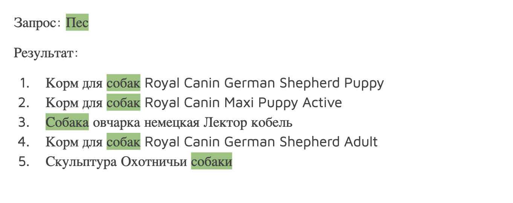
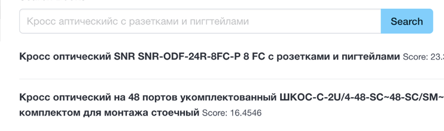
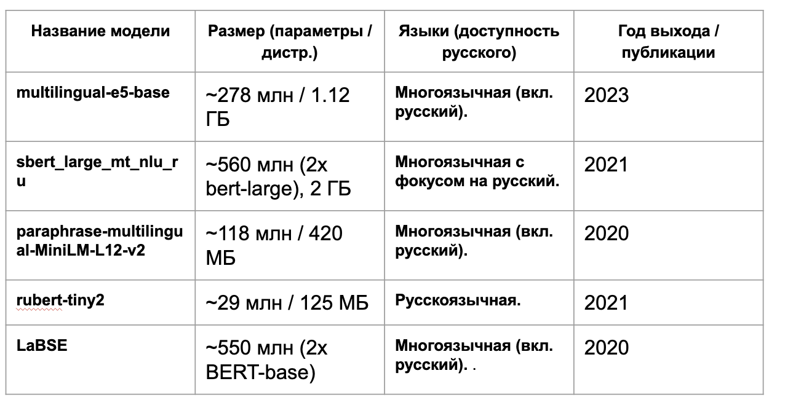

# Семантический поиск товаров из инвентаря: Команда АмурAI, 1 место, 2025
<!-- Swap the badges for your real values; delete any you don't use. -->


---

## TL;DR
Проблема: Существующие алгоритмы поиска используют сопоставление строк без учета смыслового значения слов.
Необходимо: Разработать интеллектуальный поиск на базе ИИ с определением ключевых слов и идентификаторов записи ТМЦ.
Заказчик: РусГидро.


**Why it matters:** Ускоряет поиск в петабайтах данных и позволяет находить неточные совпадения (fuzziness, ngram). И Превращает сырой запрос в "понимаемый" машиной вектор или набор семантических признаков.


## Key results

<!-- Numbers are what makes a recruiter stop scrolling. Replace with your real metrics. -->
- **macro-F1 = [0.79]**  0.98 accuracy на бенчмарке
- создали бенчмарк для оценки модели поиска товаров
- протестировали 5 NLU моделей для русского языка на бенчмарке
- составили взвешенную модель из двух алгоритмов (семантический поиск + elastic search)

## Demo

<!-- One good visual beats three paragraphs. Drop a heatmap / index chart / report screenshot here. -->





## How it works

```
    Data           ──►  Benchmark           ──►        LLMs            ──►  elastic search  ──► Combination
 (Prepared)            (random change,         (RuBERT, sbert large)
                     synonem, word removal )             
                          
```

## Tech stack

`Python 3.11` · `huggingface` · `PyTorch` · `transformers (RuBERT, LaBSE, sbert)` · `pymorphy3` · `scikit-learn` · `pandas` 


## Related work

- 📄 Paper: [title / link]
- 📊 Live channel: [link]
- ✍️ Write-up: [blog / link]

## License

Built by [Khamazaev Ruslan] · [ruslan.khamazaev1@gmail.com] 
